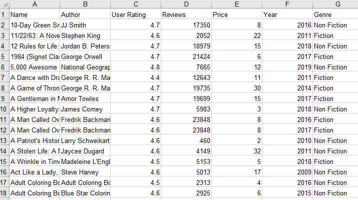
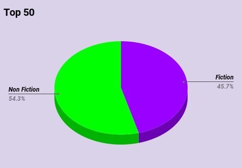

# Top-50-Amazon-Books

## Project Overview
- Genre Comparison, Fiction vs No Fiction, Top 10
- Dataset taken from https://www.kaggle.com/ 
- Tools: Google Sheets, Google Slides, Tableau 

## Cleaning Process
The data show the best sellers over eleven years. You can see the raw data in this **[Link](https://github.com/DimKaisaris/Top-50-Amazon-Books/tree/main/Raw%20Files)**

