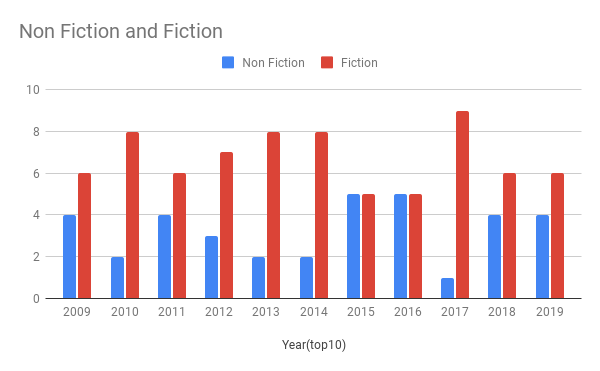

# Top-50-Amazon-Books

## Project Overview
- Genre Comparison, Fiction vs No Fiction, Top 10
- Dataset taken from https://www.kaggle.com/ 
- Tools: Google Sheets, Google Slides, Tableau 

## Process Phase
The data show the best sellers over eleven years. You can see the raw data in this **[Link](https://github.com/DimKaisaris/Top-50-Amazon-Books/tree/main/Raw%20Files)**

To clean the data I follow the steps from the **[Cleaning Log](https://github.com/DimKaisaris/Top-50-Amazon-Books/blob/main/Processed%20Files/Cleaning%20Log%20C4.docx)**
and all changes which I make during the Process and Analysis Phases I record them in the **[Change Log](https://github.com/DimKaisaris/Top-50-Amazon-Books/tree/main/Processed%20Files)**

## Analysis Phase

To analyze the data I used my **[Analysis Log](https://github.com/DimKaisaris/Top-50-Amazon-Books/blob/main/Processed%20Files/_Analysis%20Log%20C4.docx)** to help me out.
Used some basic fuctions, pivot tables and charts. Check the **[Bestsellers_No Duplicates](https://github.com/DimKaisaris/Top-50-Amazon-Books/blob/main/Processed%20Files/_Bestsellers%20NO%20Duplicates%20(1).xlsx)** to see the spreadsheet if you please.
Here's some charts.

### 1) Top10 , Fiction vs Non Fiction

### 2) Number of Reviews

## Share Phase

To share the findings I used my **[Share Log](https://github.com/DimKaisaris/Top-50-Amazon-Books/blob/main/Processed%20Files/Share%20Log%20C4.docx)** and created 
a **[Presentation](https://github.com/DimKaisaris/Top-50-Amazon-Books/tree/main/Presentation)** and a dashboard in tableau , use **[Link](https://public.tableau.com/app/profile/dimitris.kaisaris4695)**

## Thank You!
